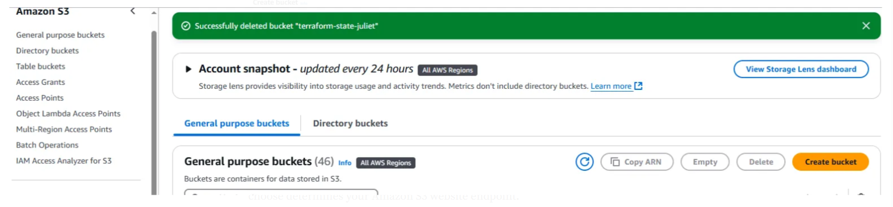
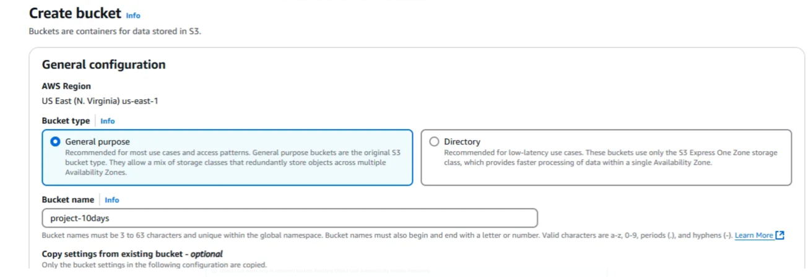
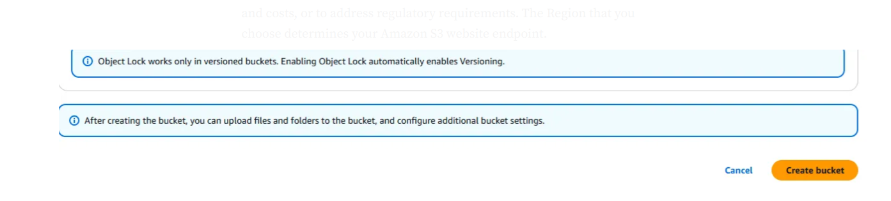

# Configuring-a-static-website-on-Amazon-S3
Configure a static website on Amazon S3 by creating a bucket, uploading your HTML/CSS files, enabling static website hosting, and setting permissions to make the content publicly accessible. Optionally, connect it to a custom domain using Route 53 and CloudFront.

### **Prerequisites**
AWS account
Source
https://docs.aws.amazon.com/AmazonS3/latest/userguide/HostingWebsiteOnS3Setup.html#step7-test-web-site

### **Step 1: Create a bucket**
1. Sign in to the AWS Management Console and open the Amazon S3 console.
2. Choose Create bucket.

3. Enter the name you want to use for your bucket.

4. Choose a Region that is geographically close to you to minimize latency and costs, or to address regulatory requirements. The Region that you choose determines your Amazon S3 website endpoint.
5. Choose Create.

6. Bucket is created.
