# Configuring-a-static-website-on-Amazon-S3
Configure a static website on Amazon S3 by creating a bucket, uploading your HTML/CSS files, enabling static website hosting, and setting permissions to make the content publicly accessible. Optionally, connect it to a custom domain using Route 53 and CloudFront.

### **Prerequisites**
AWS account
Source
https://docs.aws.amazon.com/AmazonS3/latest/userguide/HostingWebsiteOnS3Setup.html#step7-test-web-site

### **Step 1: Create a bucket**
1. Sign in to the AWS Management Console and open the Amazon S3 console.
2. Choose Create bucket.

3. Enter the name you want to use for your bucket.

4. Choose a Region that is geographically close to you to minimize latency and costs, or to address regulatory requirements. The Region that you choose determines your Amazon S3 website endpoint.
5. Choose Create.

6. Bucket is created.

### **Step 2: Enable static website hosting**
1. In the buckets list, choose the name of the bucket that you just created.
2. Under Static website hosting, choose Edit.
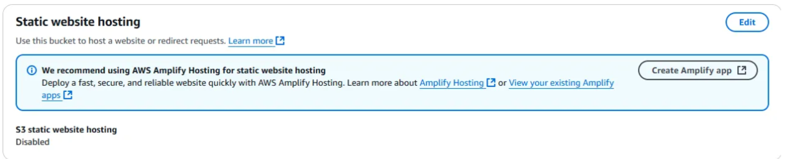
3. Choose Use this bucket to host a website.
4. Under Static website hosting, choose Enable.
5. In the Index document, enter the name typically index.html.
6. In the error document, enter the name 404.html.
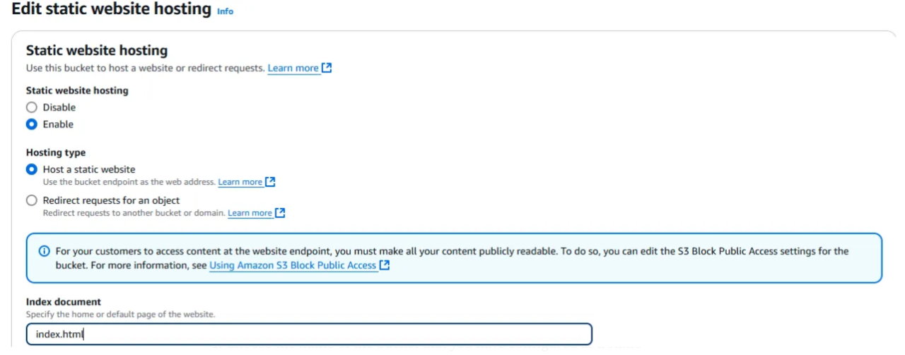
7. Choose Save changes.
8. Under Static website hosting, note the Endpoint.

### **Step 3: Edit Block Public Access settings**
1. Choose the name of the bucket that you have configured as a static website.
2. Choose Permissions.
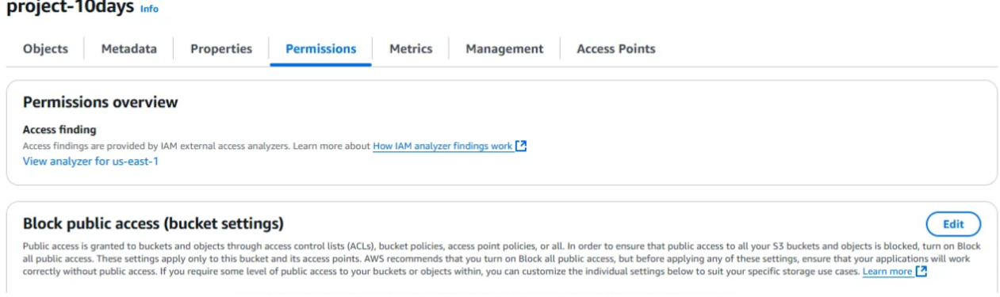
3. Under Block public access (bucket settings), choose Edit.
4. Uncheck the Block all public access
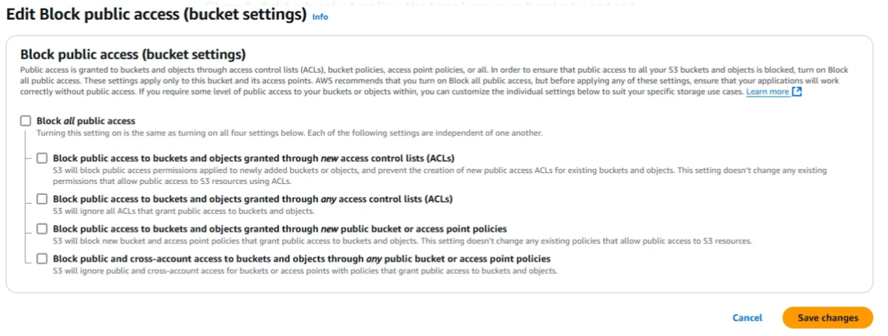
5. Click Save changes.

### **Step 4: Add a bucket policy that makes your bucket content publicly available**
1. Under Buckets, choose the name of your bucket.
2. Choose Permissions.
3. Under Bucket Policy, choose Edit.
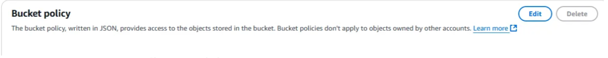
4. To grant public read access for your website, copy the following bucket policy, and paste it in the Bucket policy editor.

{
    "Version": "2012-10-17",
    "Statement": [
        {
            "Sid": "PublicReadGetObject",
            "Effect": "Allow",
            "Principal": "*",
            "Action": [
                "s3:GetObject"
            ],
            "Resource": [
                "arn:aws:s3:::Bucket-Name/*"
            ]
        }
    ]
}

5. Update the Resource to your bucket name.
6. Choose Save changes.

### **Step 5: Configure the index document**
1. Create and save an index.html file locally.

<html xmlns="http://www.w3.org/1999/xhtml" >
<head>
    <title>My Website Home Page</title>
</head>
<body>
  <h1>Welcome to my website</h1>
  
Now hosted on Amazon S3!

</body>
</html>

2. Go to your AWS Management Console and open the Amazon S3.
3. In the left navigation pane, choose General purpose buckets.
4. In the buckets list, choose the name of the bucket that you want to use to host a static website.
5. To upload the index document to your bucket, do one of the following:

    Drag and drop the index file into the console bucket listing.
    Choose Upload, and follow the prompts to choose and upload the index file.
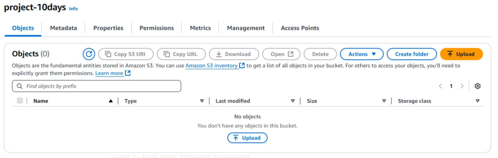
6. Upload the other error document content to your bucket.
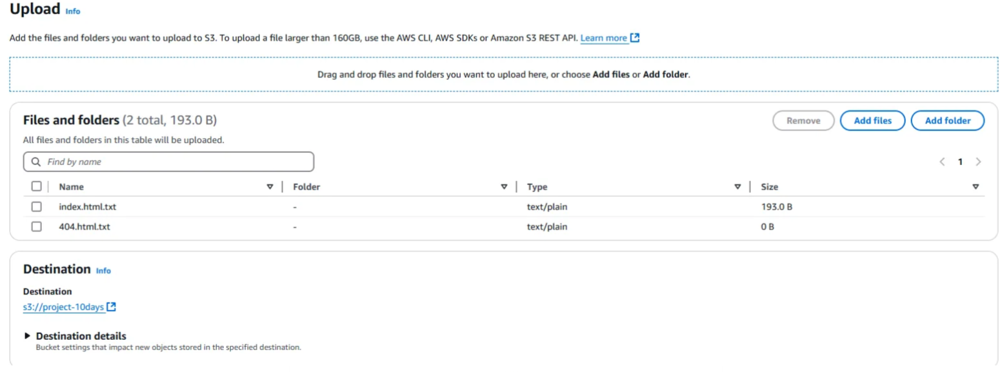

### **Step 7: Test your website endpoint**
1. Under Buckets, choose the name of your bucket.
2. Choose Properties.
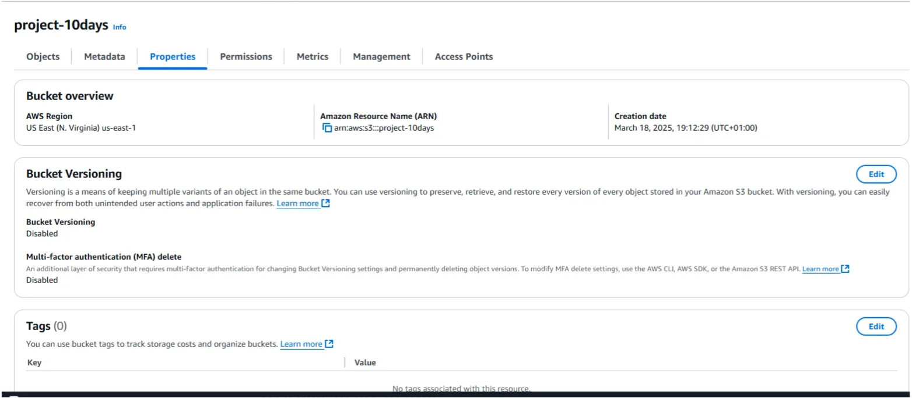
3. At the bottom of the page, under Static website hosting, choose your Bucket website endpoint. Your index document opens in a separate browser window.
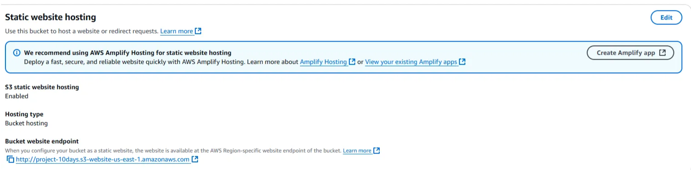
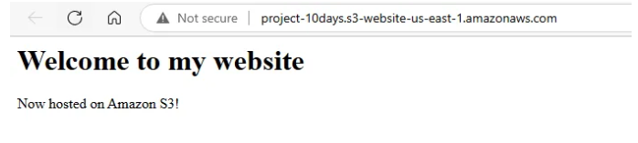

Success!
You now have a website hosted on Amazon S3.

### **Step 8: Clean up**
Delete the AWS resources that you allocated so that you no longer accrue charges.
1. Delete Objects uploaded.
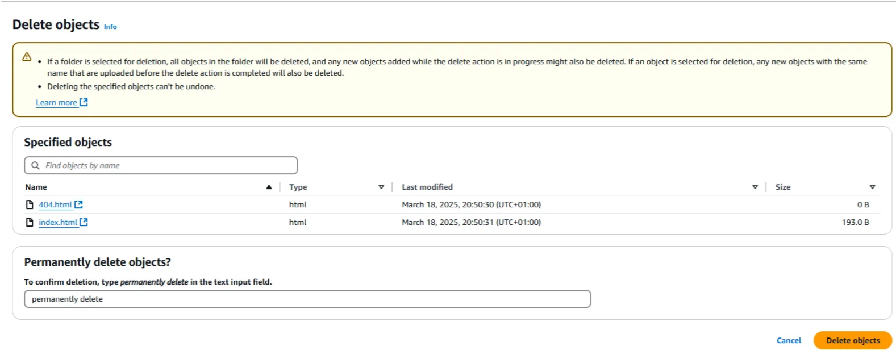
2. Then delete the bucket created.
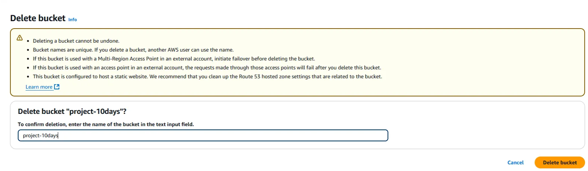